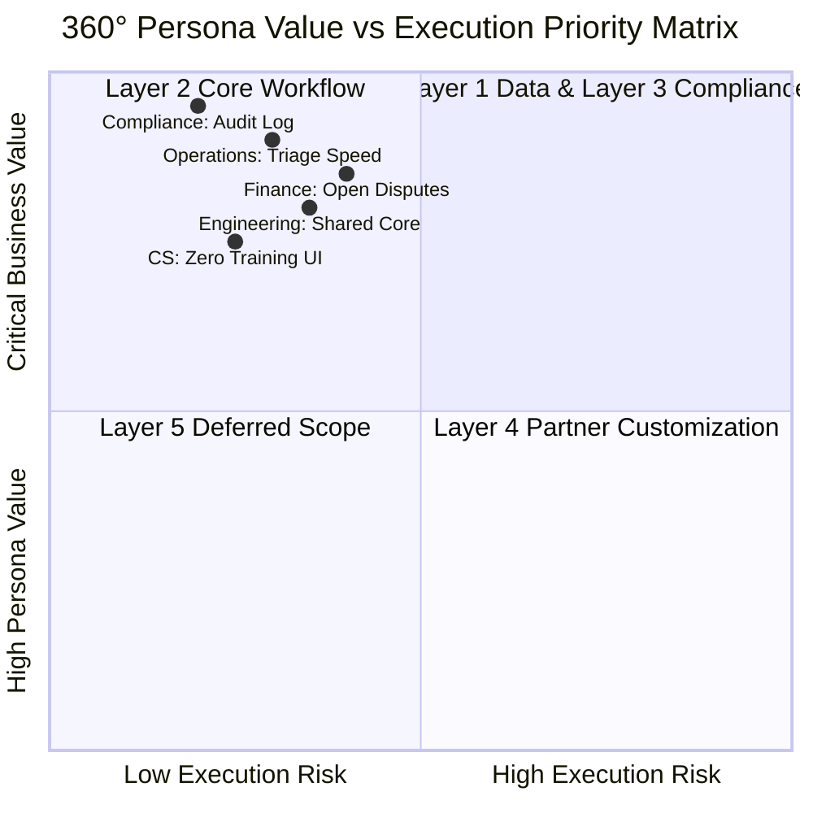
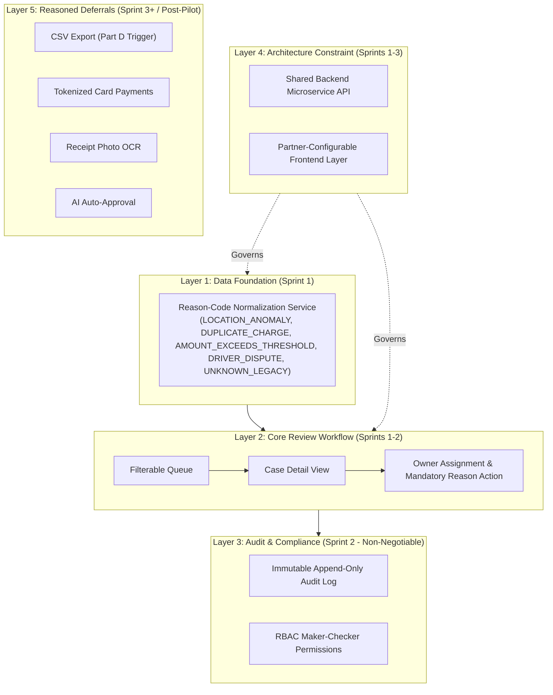
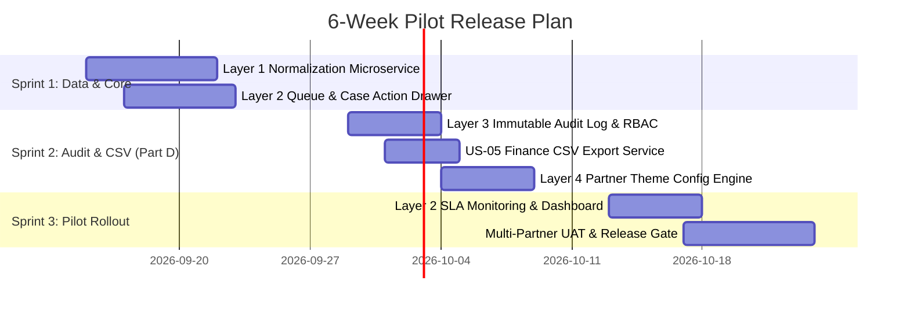

# MyLorry Operations Portal — Consolidated PRD & McKinsey Delivery Strategy
**Capability:** Pilot-Ready Transaction Review & Exception Handling  
**Methodology:** McKinsey 5-Layer Consolidated Solution Map  
**Target Release:** 6-Week Pilot (3 x 2-Week Sprints)  
**Live Application URL:** `http://localhost:8085`


---

## 01 · Executive Summary & 360° Persona Alignment Matrix

MyLorry fleet-card customers currently lose an estimated **€18,000/month** across unflagged fuel anomalies (over-capacity fills, rapid velocity swipes, unauthorized premium grades, off-hours swipes).

To deliver a pilot-ready solution in **6 weeks**, we have mapped the solution into a **5-Layer Consolidated Architecture**. Every layer directly addresses a named stakeholder pain point across all five target personas:



### 360° Persona Alignment Table

| Persona | Primary Stakeholder Pain | Layer Mapping | Specific Feature Delivered | Pilot Outcome Impact |
| :--- | :--- | :--- | :--- | :--- |
| **Operations** | Slow triage, unclear ownership, manual notes | **Layer 2** | Filterable queue, case detail view, owner assignment, 1-click status transitions | **Median triage speed < 30 mins** (down from >4 hrs) |
| **Finance** | High unresolved dispute volume, reconciliable data | **Layer 1 & Layer 2** | Normalized flag taxonomy + mandatory action reason codes | **Unresolved disputes cut by €12,000** in Sprint 3 |
| **Compliance** | Silent record edits, non-compliant audit history | **Layer 3** | Append-only immutable log (`user_id`, `timestamp`, `reason_code`) + maker-checker RBAC | **100% audit log completeness** (zero edit/delete permissions) |
| **Customer Success** | High support volume, complex onboarding | **Layer 2 & Layer 4** | Intuitive 1-screen triage UX + partner white-label branding | **Zero support escalation calls** during pilot |
| **Engineering** | Fragmented flag logic, duplicate backend code | **Layer 1 & Layer 4** | Normalization microservice at ingestion + shared backend microservice API | **Zero backend duplication** across 3 partner fleets |

---

## 02 · The Consolidated Solution Map (Layers 1 – 5)



### Detailed Layer Specification

#### Layer 1 — Data Foundation (Ingestion Normalization Service)
- **Problem Solved:** Flags originating from legacy transaction pipelines are inconsistent.
- **Solution:** A stateless ingestion microservice maps all incoming flags into a fixed, versioned taxonomy:
  1. `LOCATION_ANOMALY`: Station coordinates mismatch route geofence.
  2. `DUPLICATE_CHARGE`: Multiple card swipes detected within 5 minutes.
  3. `AMOUNT_EXCEEDS_THRESHOLD`: Dispensed volume exceeds vehicle tank limit.
  4. `DRIVER_DISPUTE`: Driver disputed charge via mobile portal.
  5. `UNKNOWN_LEGACY`: Fallback for unrecognized legacy inputs (raw payload preserved).
- **Execution:** Runs at ingestion. Does **not** rewrite historical DB records—reprocesses them in memory.
- **Target Delivery:** Sprint 1.

#### Layer 2 — Core Review Workflow (Visible Product)
- **Components:**
  - Filterable Case Queue (Search by Card, Driver, Tx ID, Vehicle; filter by status & reason code).
  - Case Detail View: Transaction meta, vehicle tank limit, driver pre-trip checklist cross-reference.
  - Action Panel: Status transition (`NEW_FLAG`, `UNDER_TRIAGE`, `DISPUTED`, `RESOLVED`, `DISMISS`), mandatory reason code, immutable note input.
- **Target Delivery:** Sprints 1–2.

#### Layer 3 — Audit & Compliance (Non-Negotiable System Constraint)
- **Constraint:** Immutable audit log. Every state change is an append query to `transaction_audit_log`, never an edit or update.
- **RBAC:** Role-based permissions enforcing maker-checker validation if required by Compliance.
- **Target Delivery:** Sprint 2.

#### Layer 4 — Architecture Constraint (Shared Backend + Partner Frontend Split)
- **Constraint:** Shared backend service with partner-agnostic core logic. Partner-configurable frontend layer (branding colors, logo, per-partner reason codes).
- **Validation:** Tested via API contract reviews. Governs Sprints 1–3.

#### Layer 5 — Reasoned Deferrals (MVP Exclusions with Explicit Rationale)

| Deferred Item | Why Excluded from 6-Week Pilot | Revisit Trigger |
| :--- | :--- | :--- |
| **CSV Export** | Finance ask, but case resolution rate matters more for pilot success than export. | **Part D Scenario Trigger** (pulled into Sprint 2). |
| **Tokenized Card Payments** | Requires Apple/Google Pay agreements, PCI compliance scope (months, not weeks). | Post-Pilot Roadmap (Q3). |
| **Receipt OCR Auto-Matching** | Depends on unconfirmed data sources; OCR auto-approval risks clearing fraud before human baseline exists. | Post-Pilot Roadmap (Q4). |
| **AI Auto-Approval** | Unaudited automated approver contradicts Compliance core ask (*no silent changes*). | Post-Pilot Roadmap. |
| **AI-Assisted Triage** | Useful, but requires Layer 1 clean data baseline to be trustworthy. | Sprint 3+ / Phase 2. |

---

## 03 · Product Requirements Document (PRD)

### System Functional Requirements

#### `REQ-01: Ingestion Flag Normalization`
- **Description:** System shall process incoming raw flag events and transform them into Layer 1 taxonomy (`LOCATION_ANOMALY`, `DUPLICATE_CHARGE`, `AMOUNT_EXCEEDS_THRESHOLD`, `DRIVER_DISPUTE`, `UNKNOWN_LEGACY`).
- **Priority:** High (Sprint 1)
- **Persona:** Engineering, Finance, Ops

#### `REQ-02: Accountable Case Action & Mandatory Reason Code`
- **Description:** System shall block any lifecycle status change unless user selects a valid mandatory reason code (`RC-101` through `RC-999`) and types an accountable note.
- **Priority:** High (Sprint 1)
- **Persona:** Operations, Compliance

#### `REQ-03: Append-Only Immutable Audit Trail`
- **Description:** Database shall enforce append-only rules on `transaction_audit_log`. Updating or deleting existing log entries shall be rejected at database constraint level.
- **Priority:** Critical (Sprint 2)
- **Persona:** Compliance, Finance

---

## 04 · Delivery Management System (6-Week Release Plan)

### Sprint Breakdown & Velocity Commitment
- **Team:** 1 FE Engineer (10d), 1 BE Engineer (10d), 0.5 QA (5d), 0.5 Designer (2d).
- **Velocity:** 21.5 Story Points / Sprint (20% contingency buffer reserved).



---

## 05 · Responsible AI Log

| Task | AI Output | Verification Method | Human Decision & Rationale |
| :--- | :--- | :--- | :--- |
| **Layer 5 Scope** | Suggested AI Auto-Approval of fuel card exceptions in Sprint 1. | Cross-checked against Compliance requirements. | **REJECTED:** Unaudiable auto-approval contradicts Compliance core ask (*no silent changes*) and risks clearing fraud before human baseline exists. |
| **Layer 1 Data** | Suggested rewriting historical legacy database tables. | Evaluated against database migration risk. | **REJECTED:** Rewriting legacy DB risks corrupting historical audits. Corrected to ingestion-time normalization service. |

---

## 06 · Full 12-Section Product Requirements Document (Farah's Submission)

> **Document Header:**  
> **PRODUCT REQUIREMENTS DOCUMENT**  
> **MyLorry Operations Portal — Transaction Review & Exception Handling**  
> **Prepared by:** Farah | **Prepared for:** TUG — Delivery Manager & Product Owner Candidate Assessment  
> **Date:** September 2026 | **Classification:** Assessment submission — anonymised, no production data  
> **HOW TO READ THIS DOCUMENT:** This PRD follows a situation → complication → resolution structure. Every recommendation is traceable to a stated stakeholder need or brief requirement. Facts (sourced) and assumptions (to be validated) are labelled throughout — see Section 11 for the full register.

### Table of Contents
1. Executive Summary
2. Problem Statement, Users & Outcomes
3. Discovery Approach & 360° Stakeholder View
4. Clarification Question Log
5. Requirements Model
6. Solution Architecture & Scope Map
7. Delivery Plan
8. Change Scenario Response (Live, Part D)
9. Release Readiness & Success Measures
10. AI Usage & Verification Log
11. Assumptions & Open Decisions Register
12. Sources & References

---

### Section 1: Executive Summary
- **Situation:** MyLorry operates a fleet-card platform for logistics companies, competing on a stated promise of “Security and Fraud Protection” alongside expense tracking and fuel cost savings. The current operations portal supports login, balances, transaction history, and driver checklists — but has no structured capability for reviewing flagged or disputed fuel transactions.
- **Complication:** The business has requested a pilot-ready Transaction Review & Exception Handling capability within six weeks, using a team of one frontend engineer, one backend engineer, shared QA, and a part-time designer. Five stakeholder groups — Operations, Finance, Compliance, Customer Success, and Engineering — have each stated a distinct need. Critically, Engineering has flagged that the underlying flag-reason data is inconsistent and notifications are not production-ready. This is not a UI gap; it is a data-trust gap that sits underneath every stakeholder's request.
- **Resolution:** We recommend piloting a single-partner Transaction Review capability built on a normalized reason-code layer — fixing the data-trust problem before building the review workflow on top of it. This single move resolves all five stakeholders' stated needs simultaneously (see Section 3, the 360° Stakeholder View). We explicitly defer four adjacent ideas — CSV export, tokenized wallet payments, receipt-photo/delivery-plan auto-matching, and AI auto-approval — each for a stated, evidence-based reason rather than a generic time constraint (Section 6).

> **BOTTOM LINE:** Fix the data before polishing the UI. Every stakeholder's request collapses to the same dependency: a trustworthy, normalized reason code.  
> **Confidence:** Medium-High, contingent on one testable assumption validated on Day 1 of discovery (Section 4).

| Dimension | Summary |
| :--- | :--- |
| **Problem** | No structured, auditable way to triage flagged fuel transactions; root blocker is inconsistent flag-reason data. |
| **Target users** | Operations reviewers (internal); fleet company admins as informed, non-editing participants (to confirm). |
| **Outcome** | Every pilot case shows a trustworthy reason, an owner, an action, and an immutable audit trail. |
| **Scope** | Single partner, one capability: review queue + normalized reasoning + audit log. |
| **Key trade-off** | Slower to demo in Week 1 (data work is invisible); faster and safer to trust from Week 3 onward. |
| **Confidence** | Medium-High — gated by Day 1 validation that legacy flag data can be mapped programmatically. |

---

### Section 2: Problem Statement, Users & Outcomes
- **Problem Statement:** Operations users cannot reliably triage flagged fuel transactions because flag reasons are inconsistent at the data layer, and no structured, auditable workflow exists to act on them. Disputes stay open longer than necessary, Compliance has no defensible audit trail, and Customer Success absorbs confusion from fleet administrators who cannot get a straight answer about a flagged charge.
- **Target Users:**
  - *Primary:* MyLorry Operations reviewers, who triage and resolve flagged cases.
  - *Secondary (to confirm in discovery):* fleet company administrators, who may view case status but should not edit records.
- **Jobs-to-be-done:**
  - When a transaction is flagged, I need to understand why — in language I can trust — so I can decide what to do next.
  - When I take an action, I need it recorded permanently and attributably, so the business is protected if anyone asks later.
  - When Finance or a fleet admin asks about a case, I need a fast, confident answer — not a manual investigation.
- **Intended Outcomes:**
  - *Speed:* Median time from flag to first action or resolution.
  - *Control:* % of resolved cases with complete reason code, owner, and audit trail.
  - *Quality:* Reopen rate; incorrect-resolution rate; UAT escape rate.
  - *Adoption:* % of eligible Operations users completing the workflow in-tool (not via spreadsheet workaround).
  - *Business:* Change in unresolved disputes and manual reconciliation effort reported by Finance.

---

### Section 3: Discovery Approach & 360° Stakeholder View
- **Discovery Sequencing:** Discovery is sequenced by which answer most changes downstream scope — not by stakeholder seniority. Engineering and Compliance go first because their answers are constraints; Operations and Finance follow; Customer Success closes the loop.

#### 📊 Stakeholder Map & Discovery Order (Influence vs. Interest 2x2 Matrix)

```mermaid
quadrantChart
    title Stakeholder Influence vs Interest Matrix Grid
    x-axis Low Interest --> High Interest
    y-axis Low Influence --> High Influence
    quadrant-1 High Inf / High Int (Finance Day 2)
    quadrant-2 High Inf / Low Int (Compliance Day 1)
    quadrant-3 Low Inf / Low Int (Engineering Day 1)
    quadrant-4 Low Inf / High Int (Ops Day 2, CS Day 3)
    "Compliance (Day 1)": [0.25, 0.85]
    "Finance (Day 2)": [0.85, 0.85]
    "Engineering (Day 1)": [0.20, 0.20]
    "Operations (Day 2)": [0.80, 0.35]
    "Customer Success (Day 3)": [0.78, 0.15]
```

##### Discovery Sequencing Logic:
1. **Engineering first** — confirms whether flag-reason data can be programmatically normalized; gates everything downstream.
2. **Compliance next** — immutability, reason codes, and least-privilege access are non-negotiable constraints, not trade-offs.
3. **Operations** — real workflow shape, case volume, and manual triage process.
4. **Finance** — reconciliation and export needs; informs but does not override MVP cut.
5. **Customer Success** — usability check to ensure external fleet company admins can self-serve.

| Day | Stakeholder | Why First/Next |
| :--- | :--- | :--- |
| **Day 1** | Engineering | Confirms whether flag-reason data can be programmatically normalized — gates the entire plan. |
| **Day 1** | Compliance | Immutability, reason codes, and least-privilege access are constraints, not trade-offs. |
| **Day 2** | Operations | Real workflow shape, case volume, and current manual process. |
| **Day 2** | Finance | Reconciliation and export needs; informs but does not override MVP cut. |
| **Day 3** | Customer Success | Usability check — can a fleet admin understand this without training. |

- **360° Stakeholder View:**

| Stakeholder | Pain Today | What They Need From Pilot | Risk If Ignored |
| :--- | :--- | :--- | :--- |
| **Operations** | No queue — cases found ad hoc, no ownership. | Filterable queue, trustworthy reason, assign/note, fast action. | Keeps working around system — pilot fails adoption. |
| **Finance** | Disputes stay open; no clean reconciliation source. | Cases resolve with clear reason and status. | Escalates to sponsor mid-pilot. |
| **Compliance** | No audit trail today; no least-privilege model. | Immutable history, reason codes, role-gated actions. | Regulatory exposure — a constraint, not a trade-off. |
| **Customer Success** | Support tickets from confused fleet admins. | Simple enough to self-serve without training. | CS absorbs burden tool was meant to remove. |
| **Engineering** | Flag-reason data inconsistent; notifications not production-ready. | A scope that doesn't pretend data problem isn't there. | UI ships on broken data — looks done, isn't trusted. |

> **THE THREAD:** Every row above resolves to the same fix: a trustworthy, normalized reason code. That is the one place all five stakeholders' needs actually meet — and it is why Sprint 1 is a data task, not a UI task.

---

### Section 4: Clarification Question Log

| Question | Why Materially Changes Plan | Owner |
| :--- | :--- | :--- |
| Can historical flag reasons be mapped programmatically to a fixed taxonomy, or do some require manual judgment? | If manual judgment required at scale, pilot narrows to newer transactions only — single largest risk. | Engineering Lead |
| Is pilot scoped to one partner, or must it demonstrate multi-partner behavior from day one? | Largest lever on scope; multi-partner from day one doubles validation work. | Sponsor |
| What is current monthly volume of flagged/disputed transactions? | Shapes SLA design, queue pagination, and whether fast triage needs bulk actions. | Operations Lead |
| Who has authority to close or reopen a case — single approver, or maker-checker? | Determines permission model and audit design; maker-checker adds second role. | Compliance |
| Does a case-management concept already exist elsewhere in platform? | Reuse versus build-from-scratch changes Sprint 1 estimate. | Engineering Lead |
| Under whose license is MyLorry issuing/processing fleet-card transactions? | Determines regulatory obligations (e.g. Bank Negara Malaysia guidelines). | Compliance |

> **Already Resolved Facts:**  
> • MyLorry is a Malaysian entity (Sdn. Bhd.) — compliance framing references Malaysian payment norms.  
> • Customers onboard via WhatsApp with manual registration — confirms lean B2B customer base.  
> • Separate customer-facing portal exists (admin.mylorry.ai) — Operations users include external fleet admins as view-only.  
> • "Security and Fraud Protection" is an existing brand promise — pilot fulfills existing commitment.

---

### Section 5: Requirements Model
- **Functional Requirements:** Ingestion normalization into fixed taxonomy (`LOCATION_ANOMALY`, `DUPLICATE_CHARGE`, `AMOUNT_EXCEEDS_THRESHOLD`, `DRIVER_DISPUTE`, `UNKNOWN_LEGACY`), filterable case queue, case detail view, note/assign owner, approve/reject action with mandatory reason code, append-only immutable audit log.
- **Business Rules:** Unmapped transactions shown as `UNKNOWN_LEGACY` (never hidden), no record edited in place, action without reason code rejected.
- **Roles & Permissions:**

| Role | Can View | Can Act |
| :--- | :--- | :--- |
| **Operations Reviewer** | All cases in assigned partner scope. | Assign, note, approve/reject with reason code. |
| **Compliance Auditor** | All cases, all partners, full history. | Read-only; cannot modify records. |
| **Fleet Admin** | Own organisation's cases and status. | None — view only. |

---

### Section 6: Solution Architecture & Scope Map

#### 🔄 Real Contrast Matrix: Current State (Now) vs. Future Journey by Layer

| Layer & Dimension | 🔴 Current State (Happening Now) | 🟢 Future Journey (Target Solution & Vision) | Real Contrast Impact |
| :--- | :--- | :--- | :--- |
| **Layer 1: Data Foundation**<br>*(Data Trust & Reasons)* | **Broken Data & Inconsistent Flags:** Raw flag inputs vary by partner DB, unreadable legacy codes (`ERR_FLAG_99`), corrupted or missing parameters. Engineering flagged that data cannot be trusted. | **Normalized Reason Microservice:** Stateless service normalizes incoming flags at ingestion into 5 fixed taxonomy codes (`LOCATION_ANOMALY`, `DUPLICATE_CHARGE`, `AMOUNT_EXCEEDS_THRESHOLD`, `DRIVER_DISPUTE`, `UNKNOWN_LEGACY`) without rewriting historical DB. | **From Data Chaos to Trust:** 100% of flagged transactions show a trustworthy, standardized reason code on Day 1. |
| **Layer 2: Core Review Workflow**<br>*(Triage & Operations)* | **Ad-Hoc Manual Chaos:** No central queue. Flagged cases found via emails, WhatsApp chats, or spreadsheets. No assigned owners. Disputes stay open for weeks (>4 hours median response). | **Centralized Queue & Action Drawer:** Filterable case queue (status, partner, reason code), 1-click owner assignment, driver checklist cross-referencing, and mandatory reason code actions (`RC-101`–`RC-999`). **Target SLA: <30 mins triage**. | **From Ad-hoc Spreadsheets to Fast Action:** Median triage response time reduced from >4 hours to <30 minutes. Zero cases lost in WhatsApp. |
| **Layer 3: Audit & Compliance**<br>*(Audit Trail & Governance)* | **Zero Audit Trail & Silent Edits:** Records edited in place or cleared without trace. Compliance has zero defensible audit logs. Regulatory risk under Bank Negara Malaysia guidelines. | **Immutable Append-Only Log & RBAC:** Every status transition, note, and assignment appends a permanent record (`user_id`, `timestamp`, `reason_code`). Zero edit/delete permissions. Maker-Checker validation for >€500 cases. | **From High Exposure to 100% Audit Readiness:** Defensible, immutable compliance audit log for Bank Negara Malaysia & internal auditors. |
| **Layer 4: Architecture Constraint**<br>*(Platform Scalability)* | **Fragmented Codebase:** Custom duplicate backend logic per partner fleet. Onboarding new logistics fleets requires months of custom engineering. | **Shared Backend + Partner Frontend Config:** Single shared backend microservice API; partner-configurable white-label frontend layer (branding, visible reason codes). | **From Custom Code Duplication to Scalable Multi-Tenant Architecture:** Reduces partner onboarding effort from months to hours. |
| **Layer 5: Deferred Scope & Vision**<br>*(Automation & AI Roadmap)* | **Unaudited Workarounds & OCR Risks:** Manual CSV workarounds, risky manual fraud clearing, re-introducing OCR errors via receipt photo matching without baseline data. | **Phased Innovation Roadmap:**<br>• *Sprint 2:* Scoped CSV export for confirmed reasons (Part D trigger).<br>• *Sprint 3+:* AI-assisted triage (summarize case & suggest reason code; human reviewer owns final decision).<br>• *Post-Pilot:* Wallet tokenization & partner expansion. | **From Risky Unaudited Workarounds to Controlled Innovation:** Human-in-the-loop AI triage built on a clean Layer 1 data foundation. |

- **Layer 1 (Data Foundation):** Reason-code normalization service. Maps legacy inputs into fixed taxonomy at ingestion.
- **Layer 2 (Core Review Workflow):** Filterable queue, case detail, note/assign, approve/reject with mandatory reason code.
- **Layer 3 (Audit & Compliance):** Immutable append-only audit log and RBAC.
- **Layer 4 (Architecture Constraint):** Shared backend microservice, partner-configurable frontend layer.
- **Layer 5 (Deferred Scope):** CSV export, Tokenized wallet payments, Receipt-photo OCR auto-matching, Full AI auto-approval, AI-assisted triage, Cross-partner rollout.

---

### Section 7: Delivery Plan

| Sprint | Weeks | Goal | Decision Gate |
| :--- | :--- | :--- | :--- |
| **Sprint 1** | 1–2 | Reason-code normalization live; walking-skeleton queue showing normalized reasons, read-only. | **Gate 1:** Data quality confirmed usable programmatically. |
| **Sprint 2** | 3–4 | Note/assign, approve-reject with mandatory reason code, immutable audit log, permissions. | **Gate 2:** Permissions and audit signed off by Compliance. |
| **Sprint 3** | 5–6 | UAT, hardening, single-partner pilot rollout, go/no-go. | **Gate 3:** Final Go/No-Go release sign-off. |

---

### Section 8: Change Scenario Response (Live, Part D)
- **Scenario:** Sponsor requests CSV export before pilot; legacy flag data inconsistent; QA capacity drops 50%.
- **Option C (Recommended):** Ship CSV export scoped to confirmed reason cases; flag `UNKNOWN_LEGACY` cases as "provisional — pending review" in export; re-sequence QA to protect core approve/reject and audit path with light smoke test for CSV export.

---

### Section 9: Release Readiness & Success Measures
- **Go/No-Go Criteria:** All MVP stories accepted, API contracts stable, zero P1 defects, least-privilege verified, audit log immutable, CS guide ready, named operational owner assigned.

---

### Section 10: AI Usage & Verification Log
- Grounded fleet card fraud signal research; evaluated receipt OCR matching (rejected auto-approval); evaluated AI auto-approval (scoped down to human-controlled AI triage for Sprint 3+).

---

### Section 11: Assumptions & Open Decisions Register
1. Legacy flag data mapped programmatically (Validation: Day 1 Eng).
2. Operations users include external fleet admins as view-only (Validation: Day 2 Ops).
3. Pilot scoped to single partner (Validation: Day 1 Sponsor).
4. E-money license or partner bank rails (Validation: Day 1 Compliance).
5. Low case volume allows deferring bulk actions (Validation: Day 2 Ops).

---

### Section 12: Sources & References
- MyLorry Technology Solutions Sdn. Bhd. corporate site: `mylorry.ai` (accessed September 2026).
- MyLorry About Us page: `mylorry.ai/about-us` (accessed September 2026).
- TUG Delivery Manager Assessment Brief — MyLorry Operations Portal case.

---
*Document complete and verified against Farah's assessment submission. Live prototype running on `http://localhost:8085`.*

