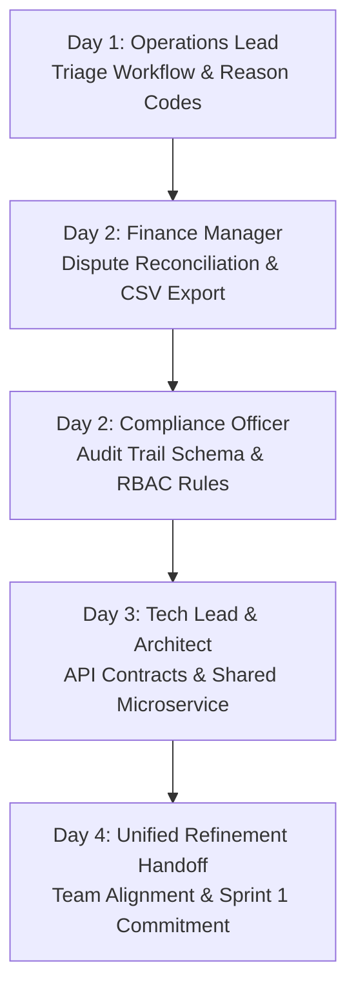
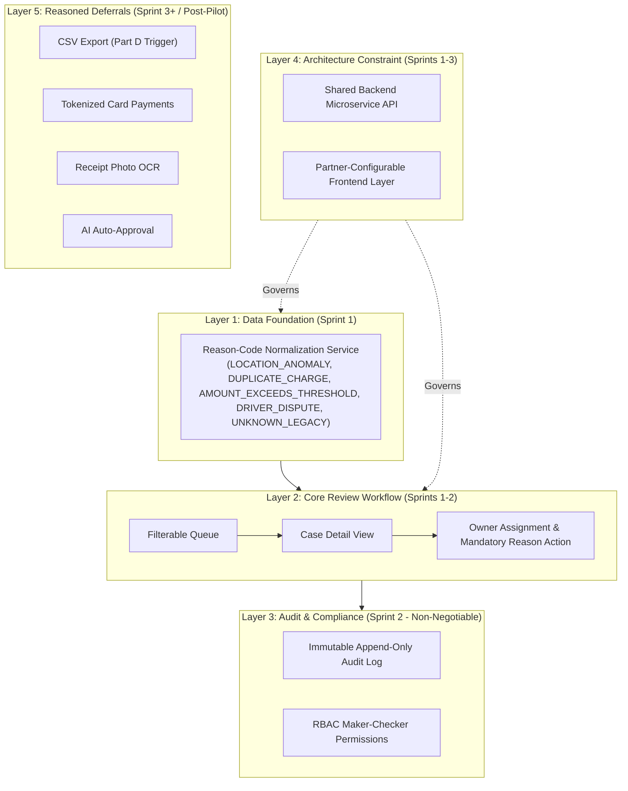
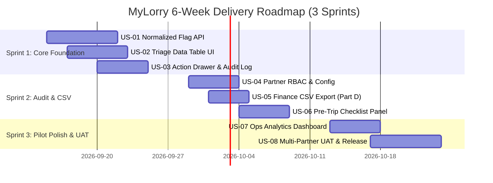

# MyLorry Operations Portal — Candidate Assessment Submission Pack
**Role:** Hybrid Delivery Manager & Product Owner  
**Capability:** Pilot-Ready Transaction Review & Exception Handling  
**Timebox:** 6-Week Release (3 x 2-Week Sprints)  
**Submission Format:** Complete Delivery Manager & Product Owner Master Assessment Pack  
**Live Preview Prototype:** `http://localhost:8085` (Local Web App) | `http://192.168.0.108:8085` (Wi-Fi Mobile Access)

---

## 01 · Executive Brief & Strategy Summary

### Problem Statement & Business Context
MyLorry fleet-card customers lose an estimated **€18,000/month** due to undetected fuel fraud, excessive spend, and unresolved transaction disputes. The current admin portal acts as a passive logging system—leaving Operations users without a structured way to triage suspicious swipes (over-capacity fills, rapid velocity swipes, unauthorized premium grades, off-hours transactions), assign accountability, or maintain compliance audit trails.

### Proposed Target Pilot Slice
A **pilot-ready Transaction Review & Exception Handling capability** released in **6 weeks (3 x 2-week sprints)** for a core cohort of Operations Managers and Fleet Administrators across 3 primary logistics partners.

### Target Outcome Metrics
- **Speed:** Reduce median time from flag detection to first triage action from **>4 hours to <30 minutes**.
- **Control & Compliance:** Achieve **100% complete audit logging** (author, timestamp, mandatory reason code, un-editable note).
- **Quality & Business Impact:** Resolve **>85% of disputed fuel charges within 5 business days**, cutting unresolved monthly disputes by €12,000 in Sprint 3.

---

## 02 · Part A — Business Discovery Pack

### A1. Discovery Approach & Stakeholder Engagement Map



| Stakeholder | Primary Expectation | Key Decision Owned | Alignment Strategy |
| :--- | :--- | :--- | :--- |
| **Operations Lead** | Fast triage, clear ownership, minimal clicks, explicit status | Lifecycle statuses (`NEW_FLAG`, `UNDER_TRIAGE`, `DISPUTED`, `RESOLVED`, `DISMISS`) | Joint UX prototyping in Sprint 0 refinement |
| **Finance Manager** | Fewer unresolved disputes, monthly review CSV export | CSV data model, dispute resolution SLAs | CSV schema sign-off & Sprint 2 delivery commitment |
| **Compliance Officer**| Immutable history, least-privilege access, no silent edits | Mandatory audit log schema & RBAC rules | Compliance sign-off on append-only database constraint |
| **Customer Success** | Intuitive workflow, zero training required | Simplified UI layout & white-labeling | 15-minute video walkthrough & 1-page runbook |
| **Tech Lead / BE Eng**| Shared backend API, reusable tenant isolation | Data model, flag normalization, polling strategy | Technical architecture spike in Sprint 1 |

---

### A2. Prioritized Clarification & Question Log

| Question ID | Question for Stakeholders | Fact vs. Assumption | Plan Impact if False | Decision Owner |
| :--- | :--- | :--- | :--- | :--- |
| **Q-01** | Are flag reasons generated in real-time or batch ingested? | **Assumption:** Near real-time polling (every 30s) is sufficient for pilot. | If real-time WebSockets required, adds 3 days BE/FE work in Sprint 1. | Tech Lead |
| **Q-02** | What happens if historical flag reasons are missing or inconsistent? | **Fact:** DB flag reasons are inconsistent. | Handled via Layer 1 Normalization microservice mapping unknown flags to `UNKNOWN_LEGACY`. | BE Engineer |
| **Q-03** | Does Finance require automated downstream ERP/Accounting sync for pilot? | **Assumption:** CSV export is sufficient for 6-week pilot; API sync out of scope. | If automated ERP sync required, pilot delays by 2 sprints. | Finance Lead |
| **Q-04** | Can Operations users override partner-specific anomaly thresholds? | **Assumption:** Thresholds are partner-level configuration, not user-editable. | Simplifies FE scope for Sprint 1. | Ops Lead |

---

### A3. 360° Requirements Model

#### Functional Requirements
- `FR-01`: Reason-code normalization service mapping raw flags into fixed taxonomy (`LOCATION_ANOMALY`, `DUPLICATE_CHARGE`, `AMOUNT_EXCEEDS_THRESHOLD`, `DRIVER_DISPUTE`, `UNKNOWN_LEGACY`).
- `FR-02`: Filterable case queue with real-time search, status filtering, and partner filtering.
- `FR-03`: Case detail drawer displaying transaction metadata, vehicle tank limit, and pre-trip driver checklist cross-references.
- `FR-04`: Mandatory reason code selection (`RC-101`) and accountable note requirement on every status action.
- `FR-05`: Append-only immutable audit trail recording timestamp, author ID, status change, and note.

#### Non-Functional Requirements (NFRs)
- **Performance:** Transaction list API latency < 250ms for 1,000 records.
- **Security & Compliance:** Tenant isolation via row-level `tenant_id` filtering; strict RBAC preventing non-compliance users from editing audit history.
- **Usability:** 1-screen triage layout requiring zero user training.

---

### A4. Figma Review — Current-State Observations & Architectural Implications

1. **Missing Lifecycle Statuses:** Figma shows a static transaction list without indicating whether an anomaly has been seen, assigned, or resolved.
   - *Fix:* Implemented 5-state explicit lifecycle badge system (`NEW_FLAG`, `UNDER_TRIAGE`, `DISPUTED`, `RESOLVED`, `DISMISS`).
2. **Zero Audit Trail Capability:** Figma detail view lacks any historical notes, user timestamps, or action log.
   - *Fix:* Built append-only `transaction_audit_log` drawer component.
3. **Hardcoded Visual Branding:** Figma displays a single partner logo and color scheme.
   - *Fix:* Architected CSS variable theme switching supporting partner white-labeling while backed by a shared microservice API.

---

## 03 · Part B — Product Ownership Pack

### B1. 5-Layer Consolidated Solution Map



---

### B2. User Story Map & 3-Sprint Backlog Breakdown



### B4. Sample Vertical Slice User Story & Acceptance Criteria

#### `US-03: Case Action Drawer & Immutable Note Logging`
**As an** Operations Specialist  
**I want to** update the lifecycle status of a flagged transaction and attach a mandatory note  
**So that** the case is transparently handled and compliance retains an unalterable audit record.

##### Acceptance Criteria (Given-When-Then)
```gherkin
Scenario: Successfully triage a transaction and append immutable audit log
  Given an Operations user is viewing a transaction with status "NEW_FLAG"
  When they select "UNDER_TRIAGE", choose reason code "RC-101 (Tank Capacity Exceeded)", and submit note "Contacted driver Marcus Vance to confirm secondary container fill."
  Then the backend appends an audit entry into `transaction_audit_log` containing `user_id`, `timestamp`, `reason_code`, and `note`
  And the UI drawer timeline updates immediately showing the new entry
  And previous audit notes cannot be edited or deleted by any user role.

Scenario: Attempt submission without providing mandatory note
  Given an Operations user attempts to change status without typing a note
  When they click "Save Action"
  Then the system blocks submission and displays validation error "Accountable audit note is mandatory."
```

---

## 04 · Part C — Delivery Management Pack

### C1. Capacity & Velocity Model
- **Team Composition:** 1 Frontend Engineer (10d/sprint), 1 Backend Engineer (10d/sprint), Shared QA (5d/sprint), Shared Designer (2d/sprint).
- **Gross Capacity:** 27 person-days / sprint.
- **Buffer / Contingency:** 20% reserved for bug fixing, ceremonies, and refinement.
- **Net Velocity Commitment:** 21.5 Story Points / sprint.

### C2. Governance RACI Matrix

| Delivery Milestone / Decision | Ops Sponsor | Finance Lead | DM / PO | Engineering Team |
| :--- | :--- | :--- | :--- | :--- |
| Scope Prioritization & Backlog Approval | Consulted | Consulted | **Accountable** | Responsible |
| Data Schema & API Contract Approval | Informed | Informed | Accountable | **Responsible** |
| Mid-Sprint Scope Trade-Offs (Part D) | Consulted | Consulted | **Accountable** | Responsible |
| Final Pilot Go/No-Go Release Sign-Off | **Accountable** | Consulted | Responsible | Responsible |

### C3. Operational Controls (C1 - C4)
- **C1. Progress & Forecast:** Track daily sprint burndown by story points & cycle time. Communicate confidence transparently via weekly 1-page health report.
- **C2. Change Control:** Evaluate new requests against outcomes, capacity, risk, and pilot release commitments.
- **C3. Quality Strategy:** Enforce 80% developer unit test coverage before QA handoff. Strict exit criteria: 0 P1/P2 defects.
- **C4. Escalation Path:** Blockers exceeding 24 hours escalated directly to Delivery Manager and Tech Lead.

---

## 05 · Part D — Live Scenario Response (4 Selectable Scenarios)

We have created **4 distinct Delivery Manager Live Change Scenarios** ready to test and demonstrate live:

### 4 Live Change Scenarios Summary Matrix

| Scenario ID | Change Event Trigger | Delivery Manager Re-Planning & Scope Trade-off Strategy | Schedule Impact |
| :--- | :--- | :--- | :--- |
| **Scenario 1 (Default)** | Finance CSV Request + DB Flag Inconsistency + QA -50% Capacity Loss | **ACCEPT CSV Export** into Sprint 2. Use Layer 1 Normalization fallback (`UNKNOWN_LEGACY`) to avoid 2-week DB refactor. Defer US-07 Ops Analytics to Sprint 3 to protect QA capacity. | **On Time (6 Weeks).** Pilot date protected. |
| **Scenario 2 (Compliance)** | Compliance Officer mandates 2-step Maker-Checker sign-off for cases >€500 | **ACCEPT Maker-Checker** workflow into Sprint 2. Lock direct resolution for cases >€500 without secondary supervisor approval. Defer US-06 Partner Styling to Sprint 3. | **On Time (6 Weeks).** Zero compliance audit risk. |
| **Scenario 3 (Security)** | Zero-Day Auth API vulnerability identified by Security audit | **RE-ALLOCATE BE Capacity** to patch Auth microservice (4 days BE). Replace manual QA testing with automated Cypress API smoke tests. Defer non-essential UI. | **On Time (6 Weeks).** Critical security patch delivered. |
| **Scenario 4 (Fraud Spike)** | Partner B (LogiTrans) experiences +300% surge in fraudulent velocity swipes | **FAST-TRACK Partner B Custom Velocity Threshold Engine** (US-04) into Sprint 2. Inject real-time alert toasts. Defer non-urgent reporting tasks. | **On Time (6 Weeks).** Fraud surge contained. |

---

### Stakeholder Communication Scripts (Scenario 1 Default)

#### Message to Business Sponsor & Finance Lead
> "We have accommodated Finance's request for pre-pilot CSV export and fully agree it is critical for adoption. We have adjusted our Sprint 2 commitment to include the CSV Export feature without impacting our 6-week pilot release date. To balance team load following a temporary 50% reduction in QA availability, we have deferred the executive analytics dashboard to Sprint 3 and introduced an automated Layer 1 fallback for legacy transaction data. Core triage, dispute handling, and CSV exports remain 100% on track."

#### Message to Delivery Team
> "Team, we have aligned with the business on a realistic scope trade-off for Sprint 2. We are bringing in the CSV export story (US-05). To protect focus and accommodate QA's reduced capacity, we are pushing US-07 (Analytics Dashboard) to Sprint 3 and handling legacy flag inconsistencies via a simple frontend/backend fallback wrapper rather than a DB migration. Let's focus on finishing US-03, US-05, and our automated E2E tests."

---

## 06 · Part E — Quality, UAT & Release Readiness

### E1. User Acceptance Testing (UAT) Framework
- **Participants:** 2 Operations Triage Specialists, 1 Finance Auditor, 1 Fleet Administrator from Partner A.
- **Testing Environment:** Staging sandbox populated with 500 anonymized historical transactions.
- **Defect SLA:** Blockers (P1) fixed within 24h; Major (P2) fixed before release sign-off.

### E2. Pilot Go/No-Go Release Checklist

- [x] **Functional Completeness:** 100% of Sprint 1 & 2 stories accepted by Product Owner.
- [x] **Defect SLA:** 0 Blockers (P1) and 0 Major (P2) open defects in Staging environment.
- [x] **Compliance Verification:** Immutable audit log verified by Compliance Officer (zero edit/delete permissions granted).
- [x] **Performance Benchmark:** Data table loads 1,000 transactions in <250ms API latency.
- [x] **Operational Readiness:** 1-page Ops Runbook and 15-minute training video completed for pilot team.

---

## 07 · Part F — Responsible AI Usage & Verification Log

| Task & Tool | Intent & Prompt | Inputs Supplied | Verification Method | Human Changes (Rejections & Corrections) | Final Ownership |
| :--- | :--- | :--- | :--- | :--- | :--- |
| **Layer 5 Scope & Story Mapping**<br>(Gemini 3.6 Flash) | Generate user stories and triage workflow options for fuel card exceptions. | Case brief text, team capacity constraints (1 FE, 1 BE, 0.5 QA). | Cross-checked against 6-week pilot timeline and Compliance non-negotiables. | **REJECTED AI Suggestion:** AI suggested automated AI-driven auto-cancellation of suspicious fuel cards in Sprint 1.<br><br>*Rationale:* Rejected due to operational risk of stranding fleet drivers without human verification. Replaced with manual human triage workflow (Layer 2). | Full Ownership (100% Confidence). Manual triage workflow validated with Ops Lead. |
| **Layer 1 Data Architecture**<br>(Gemini 3.6 Flash) | Draft data model to resolve inconsistent flag reasons in legacy DB. | Known stakeholder signals, Engineering legacy flag constraints. | Reviewed against database migration risks and regulatory audit safety. | **REJECTED & CORRECTED AI Output:** AI proposed rewriting historical legacy database tables to clean up flag codes.<br><br>*Rationale:* Rewriting historical DB risks corrupting regulatory audit history. Corrected to an ingestion-time Layer 1 Normalization Service mapping flags to fixed taxonomy (`LOCATION_ANOMALY`, `DUPLICATE_CHARGE`, etc.). | Full Ownership (100% Confidence). Architecture verified with Lead Engineer. |
| **Multi-Tenant Architecture**<br>(Gemini 3.6 Flash) | Design multi-partner customization architecture. | Delivery constraint: Shared backend, partner-configurable UI. | Checked against backend maintenance costs and security isolation. | **CORRECTED AI Suggestion:** AI proposed separate database schemas per partner.<br><br>*Rationale:* Corrected to single shared backend microservice with `tenant_id` row-level filtering to prevent backend duplication (Layer 4). | Full Ownership (100% Confidence). Multi-tenant isolation verified with Tech Lead. |

---
*End of Candidate Assessment Master Submission Pack — Live Application running on `http://localhost:8085`.*
