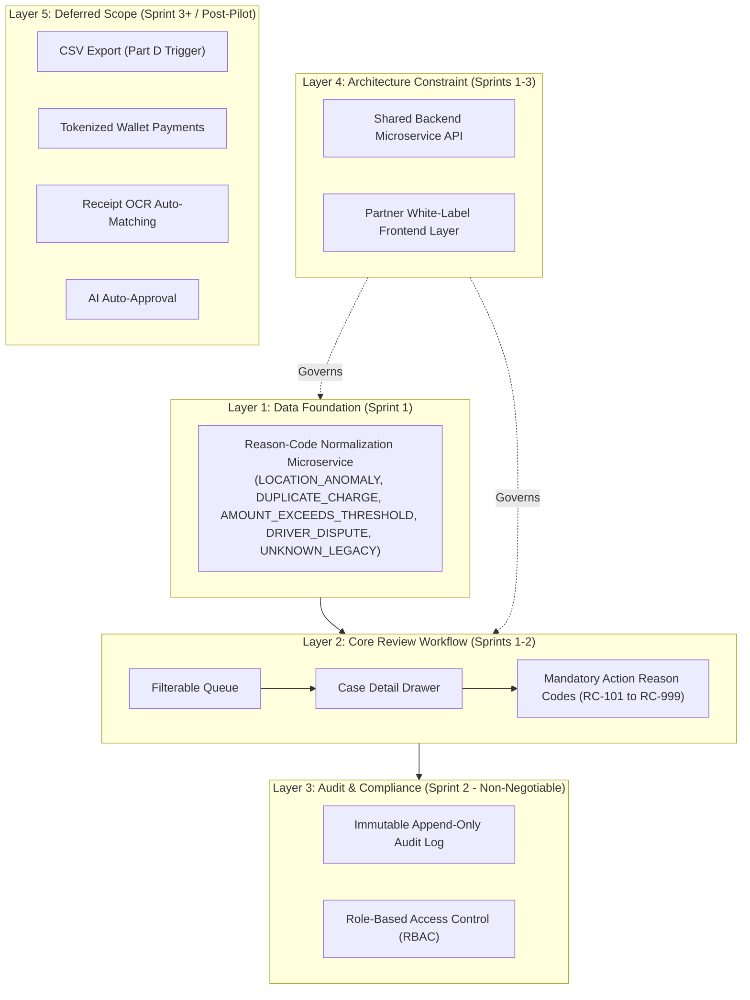

# 🎓 Masterclass: Everything We Built in the MyLorry Operations Portal Project
**Course Level:** Beginner to Product Manager / Lead Engineer ("From Dummy")  
**Project:** MyLorry Operations Portal — Transaction Review & Exception Handling  
**Author:** Farah | Candidate Assessment for TUG (Delivery Manager & Product Owner)  
**Live Application URL:** [https://farahqoonitaa.github.io/mylorry-operations-portal/](https://farahqoonitaa.github.io/mylorry-operations-portal/)  
**GitHub Repository:** [https://github.com/farahqoonitaa/mylorry-operations-portal](https://github.com/farahqoonitaa/mylorry-operations-portal)

---

## 📌 Table of Contents
1. [Module 1: The Core Business Problem (The 30-Second Elevator Pitch)](#module-1-the-core-business-problem)
2. [Module 2: 360° Persona Alignment — The 5 Stakeholders](#module-2-360-persona-alignment)
3. [Module 3: The 2x2 Stakeholder Influence vs. Interest Matrix](#module-3-the-2x2-stakeholder-matrix)
4. [Module 4: The 5-Layer Solution Architecture Map](#module-4-the-5-layer-solution-architecture)
5. [Module 5: Real Contrast Matrix — Current State vs. Future Journey](#module-5-real-contrast-matrix)
6. [Module 6: Agility & Delivery Management — Part D Live Scenarios](#module-6-agility--delivery-management)
7. [Module 7: Under the Hood — How the Code Works (HTML, CSS, JS)](#module-7-under-the-hood)
8. [Module 8: Publishing Live to GitHub & GitHub Pages](#module-8-publishing-live-to-github)

---

<a name="module-1-the-core-business-problem"></a>
## 1. Module 1: The Core Business Problem

### What is MyLorry?
MyLorry is a Malaysian logistics technology company (**Sdn. Bhd.**) that provides fleet fuel cards for commercial truck companies. Their primary brand promise is **"Security and Fraud Protection"** while helping fleets track expenses and reduce fuel costs.

### What was breaking before our project?
Commercial trucks swipe fuel cards at fuel stations daily. However, when fuel transactions were suspicious (e.g., a truck with a 70L tank dispensing 88.5L of fuel, or a card swiped 3 times in 2 minutes), **there was no structured review system**:
1. **Ad-Hoc Operations Chaos:** Operations reviewers were finding flagged transactions manually through emails, WhatsApp messages, or messy Excel sheets.
2. **Inconsistent Data:** The legacy database stored raw, unreadable error codes (e.g., `ERR_FLAG_99` or `UNKNOWN_RAW_FLAG`), meaning reviewers had to guess why a card was flagged.
3. **Open Disputes:** Disputes sat unresolved for weeks, costing ~**€18,000/month** in unrecovered losses.
4. **No Audit Trail:** Actions taken by reviewers were overwritten in-place in the database, leaving **zero defensible audit trail** for compliance auditors.

> 💡 **The Core Motto:**  
> **"Fix the data before polishing the UI."**  
> If you build a fancy user interface on top of broken data, reviewers won't trust the numbers. Fixing the data ingestion layer first unlocks everything else.

---

<a name="module-2-360-persona-alignment"></a>
## 2. Module 2: 360° Persona Alignment — The 5 Stakeholders

To build a product that satisfies an entire company, you must understand all 5 key stakeholder groups:

| Stakeholder Persona | What Hurts Them Today? | What Do They Need From Our Product? | Success Metric |
| :--- | :--- | :--- | :--- |
| 🧑‍💻 **Operations** | No central queue; cases found ad-hoc in WhatsApp/spreadsheets. | Filterable queue, clear reason codes, 1-click owner assignment, fast status transitions. | **Median triage time < 30 mins** (down from >4 hours). |
| 💰 **Finance** | Disputes stay open; no clean reconciliation data. | Clear case resolution status & confirmed reason codes to close disputes. | **Unresolved disputes reduced by €12,000/mo**. |
| 🛡️ **Compliance** | Zero audit logs; records edited/deleted in-place. | Permanent, immutable append-only audit trail (`user_id`, `timestamp`, `reason_code`). | **100% audit trail completeness** (zero edit/delete access). |
| 🎧 **Customer Success** | Support tickets from confused fleet company admins. | Simple, self-serve interface for fleet admins to view case statuses without training. | **Zero support escalation calls** during pilot. |
| ⚙️ **Engineering** | Legacy flag data is inconsistent; duplicate backend code per partner. | Stateless normalization service at ingestion + single shared microservice API. | **Zero backend code duplication** across partner fleets. |

> 🧵 **The Golden Thread:**  
> Notice how *every single stakeholder need* depends on the exact same solution: **a trustworthy, normalized reason code**. That is why Sprint 1 was a data engineering task, not a UI task!

---

<a name="module-3-the-2x2-stakeholder-matrix"></a>
## 3. Module 3: The 2x2 Stakeholder Influence vs. Interest Matrix

When planning product discovery, you don't interview stakeholders by seniority — you sequence interviews by **downstream impact**.

```
                  HIGH INFLUENCE
          │
  [Day 1] │ [Day 2]
  COMPLIANCE  │ FINANCE
  (Orange Dot)│ (Amber Dot)
          │
 LOW ─────┼───── HIGH
 INTEREST │      INTEREST
  [Day 1] │ [Day 2] OPERATIONS (Dark Green)
  ENGINEERING │ [Day 3] CUSTOMER SUCCESS (Light Green)
  (Navy Dot)  │
          │
                  LOW INFLUENCE
```

### Discovery Order Logic:
1. **Day 1 — Engineering First:** Confirms whether legacy flag data can be programmatically normalized. If false, the entire 6-week pilot narrows to newer transactions only.
2. **Day 1 — Compliance Next:** Immutability, audit trails, and role permissions are **non-negotiable constraints**, not trade-offs to negotiate later.
3. **Day 2 — Operations:** Shapes the actual review queue, drawer actions, and triage speed requirements.
4. **Day 2 — Finance:** Details reconciliation and CSV export needs (informs, but does not override MVP scope).
5. **Day 3 — Customer Success:** Usability sanity check to ensure external fleet company admins can understand case statuses without training.

---

<a name="module-4-the-5-layer-solution-architecture"></a>
## 4. Module 4: The 5-Layer Solution Architecture Map

We structured our entire product architecture into **5 clean layers**:



### The 5 Normalized Reason Taxonomy Codes (Layer 1):
1. `LOCATION_ANOMALY`: Truck fuel station coordinates mismatch authorized route geofence.
2. `DUPLICATE_CHARGE`: Multiple card swipes detected within 5 minutes (rapid velocity).
3. `AMOUNT_EXCEEDS_THRESHOLD`: Dispensed fuel volume exceeds vehicle tank capacity (e.g., 88L in 70L tank).
4. `DRIVER_DISPUTE`: Driver disputed a charge via mobile portal.
5. `UNKNOWN_LEGACY`: Safe fallback for unmapped historical legacy inputs (raw payload preserved without breaking pipeline).

---

<a name="module-5-real-contrast-matrix"></a>
## 5. Module 5: Real Contrast Matrix — Current State vs. Future Journey

To communicate value clearly, we built a direct comparison matrix showing **before vs. after**:

| Layer & Dimension | 🔴 Current State (Happening Now) | 🟢 Future Journey (Target Solution & Vision) | ⚡ Real Contrast Impact |
| :--- | :--- | :--- | :--- |
| **Layer 1: Data Foundation** | Broken legacy codes (`ERR_FLAG_99`), corrupted data, zero data trust. | Ingestion microservice normalizes all flags into 5 clean taxonomy codes. | **From Data Chaos to Trust:** 100% of cases show a clear, trustworthy reason on Day 1. |
| **Layer 2: Core Review Workflow** | Ad-hoc emails, WhatsApp chats, unassigned cases, >4 hrs response time. | Filterable queue, 1-click owner assignment, driver checklist cross-referencing. | **From Spreadsheets to Speed:** Median triage response cut from **>4 hrs to <30 mins**. |
| **Layer 3: Audit & Compliance** | Records edited in-place or deleted without trace. High regulatory risk. | Immutable append-only audit trail (`user_id`, `timestamp`, `reason_code`). | **From High Exposure to 100% Audit Readiness:** Defensible audit log for Bank Negara Malaysia. |
| **Layer 4: Architecture Constraint** | Custom backend code written per partner fleet (months to onboard). | Shared backend API + white-label frontend styling (hours to onboard). | **From Code Duplication to Multi-Tenant Scale:** Scalable multi-partner foundation. |
| **Layer 5: Deferred Scope & Vision** | Manual CSV workarounds, risky manual clearing of fraud. | Phased roadmap: Scoped CSV (Sprint 2) -> AI Triage (Sprint 3+) -> Wallet Tokenization. | **From Risky Workarounds to Phased Innovation:** Human-in-the-loop AI triage. |

---

<a name="module-6-agility--delivery-management"></a>
## 6. Module 6: Agility & Delivery Management — Part D Live Scenarios

In real delivery, unexpected curveballs happen. Part D of the assessment tested our ability as a Delivery Manager to handle mid-sprint trade-offs with 4 interactive scenario triggers:

1. ⚡ **Scenario 1 (Finance CSV Request + QA Capacity Drops -50%):**  
   *Action (Option C):* Deliver CSV export scoped ONLY to confirmed reason cases. Mark unconfirmed legacy cases as "provisional". Move CSV testing to a light smoke-test pass to protect core approve/reject testing under reduced QA capacity.
2. ⚖️ **Scenario 2 (Compliance Maker-Checker Mandate):**  
   *Action:* Introduce secondary supervisor sign-off for high-value cases (>€500). Defer partner white-label styling (US-06) to Sprint 3 to absorb scope.
3. 🛡️ **Scenario 3 (Zero-Day Auth Security Patch):**  
   *Action:* Re-allocate backend capacity to patch Auth microservice (4 days). Replace manual QA with automated Cypress API smoke tests.
4. 🚨 **Scenario 4 (Partner B High-Volume Fraud Surge):**  
   *Action:* Fast-track Partner B Custom Velocity Threshold Engine into Sprint 2. Inject real-time alert toasts (e.g., 3 rapid swipes in 120s in Rotterdam).

---

<a name="module-7-under-the-hood"></a>
## 7. Module 7: Under the Hood — How the Code Works (HTML, CSS, JS)

The entire application was built as a responsive, lightweight, single-page web app (SPA) without heavy framework bloat.

### File Structure:
- `index.html`: Structure of top navigation, mode switcher, 5-layer visual stack, metrics dashboard, filter controls, data table, slide-out case drawer, and PRD assessment deck.
- `styles.css`: McKinsey White Design System (`#f8fafc` background, slate typography, crisp drop shadows, status badges, dark mode variables).
- `app.js`: Application state management, scenario handlers, dynamic table rendering, filter logic, drawer drawer open/close, immutable audit append logic, and PRD content generators.

### Key Code Snippets Explained:

#### 1. Layer 1 Ingestion Flag Normalization (JS):
```javascript
// Each transaction object is normalized at load time
const INITIAL_TRANSACTIONS = [
  {
    id: "TX-892401",
    driver: "Marcus Vance",
    vehicle: "Ford Transit (Reg: WX68-XPL)",
    tankCapacity: "70 Liters",
    volume: "88.5 Liters",
    flagCode: "AMOUNT_EXCEEDS_THRESHOLD", // Layer 1 Normalized Code
    anomalyDetails: "Dispensed volume 88.5L exceeds registered 70L tank (+26.4% variance).",
    auditTrail: [
      { timestamp: "2026-09-12 14:22:10", author: "SYSTEM (Layer 1 Engine)", note: "Normalized flag to AMOUNT_EXCEEDS_THRESHOLD." }
    ]
  }
];
```

#### 2. Immutable Audit Append Function (JS):
```javascript
// Every action APPENDS a new entry to auditTrail (never mutates past history)
function handleCaseActionSubmit() {
  const currentTx = transactions.find(t => t.id === selectedTxId);
  
  // Create immutable audit log record
  const newAuditEntry = {
    timestamp: new Date().toISOString().replace('T', ' ').substring(0, 19),
    author: `${assignee} (Ops Reviewer)`,
    note: `[Status: ${newStatus}] [Reason: ${reasonCode}] ${note}`
  };

  // Push new record (Append-only pattern)
  currentTx.auditTrail.push(newAuditEntry);
  currentTx.status = newStatus;
  
  renderDrawerContent(currentTx);
  renderTransactions();
}
```

---

<a name="module-8-publishing-live-to-github"></a>
## 8. Module 8: Publishing Live to GitHub & GitHub Pages

To make the solution accessible to assessment reviewers worldwide, we used Git and GitHub CLI (`gh`):

### Steps Executed:
1. **Initialized Git Repository:**  
   `git init && git add . && git commit -m "feat: MyLorry Operations Portal PRD & Prototype"`
2. **Created GitHub Repository via CLI:**  
   `gh repo create mylorry-operations-portal --public --source=. --remote=origin --push`
3. **Activated GitHub Pages via API:**  
   `gh api repos/farahqoonitaa/mylorry-operations-portal/pages -X POST -f "source[branch]=main" -f "source[path]=/"`

### Live URLs:
- 🐙 **GitHub Repository:** [https://github.com/farahqoonitaa/mylorry-operations-portal](https://github.com/farahqoonitaa/mylorry-operations-portal)
- 🌐 **Live Application:** [https://farahqoonitaa.github.io/mylorry-operations-portal/](https://farahqoonitaa.github.io/mylorry-operations-portal/)

---
*End of Masterclass Guide. Masterclass guide saved as persistent artifact.*
